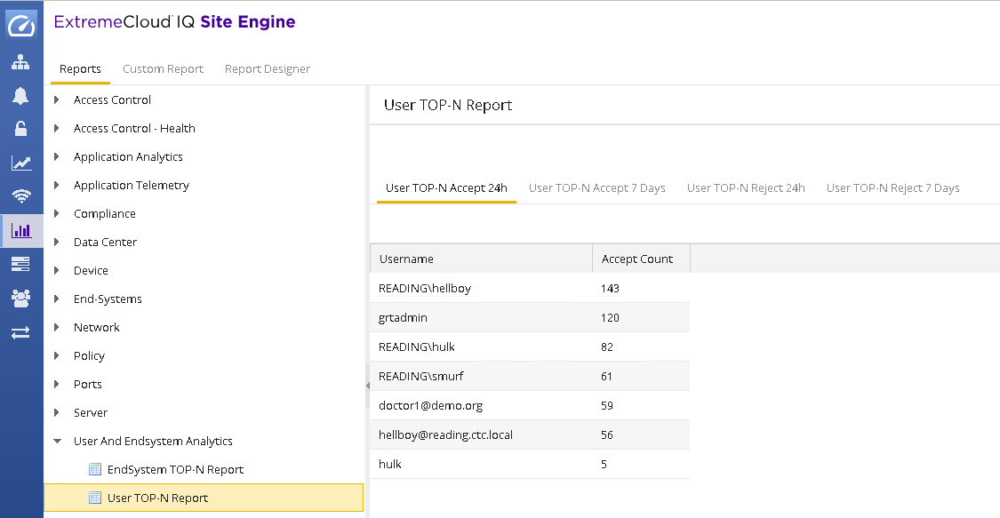

# ExtremeControl Report for OneView

### TOP N Users & Top N End-Systems
* [User TopN](UserTopN.xml) (Right-click and "Save-as")
* [EndSystem TopN](EndSystemTopN.xml) (Right-click and "Save-as")

## Installation
* Requires ExtremeCloud IQ - Site Engine (Extreme Management Center / Netsight) Server 8.1 or later

1) Download the above provided XML file. Verify if the file is XML format not HTML.

2) Place the XML file to `/usr/local/Extreme_Networks/NetSight/appdata/OneView/MyReports`.

3) Once the file is on the server, go to the reports menu.

4) Use the "Refresh" button to reload the reports.

## Support
Please visit us on [The Hub](https://community.extremenetworks.com/extreme) if you have any questions or encounter issues.

## License
Copyright© 2018, Extreme Networks.  All rights reserved.

Redistribution and use in source and binary forms, with or without modification,
are permitted provided that the following conditions are met:

1. Redistributions of source code must retain the above copyright notice, this
list of conditions and the following disclaimer.

2. Redistributions in binary form must reproduce the above copyright notice,
this list of conditions and the following disclaimer in the documentation
and/or other materials provided with the distribution.

THIS SOFTWARE IS PROVIDED BY THE COPYRIGHT HOLDERS AND CONTRIBUTORS "AS IS" AND
ANY EXPRESS OR IMPLIED WARRANTIES, INCLUDING, BUT NOT LIMITED TO, THE IMPLIED
WARRANTIES OF MERCHANTABILITY AND FITNESS FOR A PARTICULAR PURPOSE ARE
DISCLAIMED. IN NO EVENT SHALL THE COPYRIGHT HOLDER OR CONTRIBUTORS BE LIABLE
FOR ANY DIRECT, INDIRECT, INCIDENTAL, SPECIAL, EXEMPLARY, OR CONSEQUENTIAL
DAMAGES (INCLUDING, BUT NOT LIMITED TO, PROCUREMENT OF SUBSTITUTE GOODS OR
SERVICES; LOSS OF USE, DATA, OR PROFITS; OR BUSINESS INTERRUPTION) HOWEVER
CAUSED AND ON ANY THEORY OF LIABILITY, WHETHER IN CONTRACT, STRICT LIABILITY,
OR TORT (INCLUDING NEGLIGENCE OR OTHERWISE) ARISING IN ANY WAY OUT OF THE USE
OF THIS SOFTWARE, EVEN IF ADVISED OF THE POSSIBILITY OF SUCH DAMAGE.

## Support
The software is provided as is and Extreme Networks has no obligation to provide
maintenance, support, updates, enhancements or modifications.
Any support provided by Extreme Networks is at its sole discretion.

Issues and/or bug fixes may be reported on [The Hub](https://community.extremenetworks.com/extreme).

>Be Extreme
